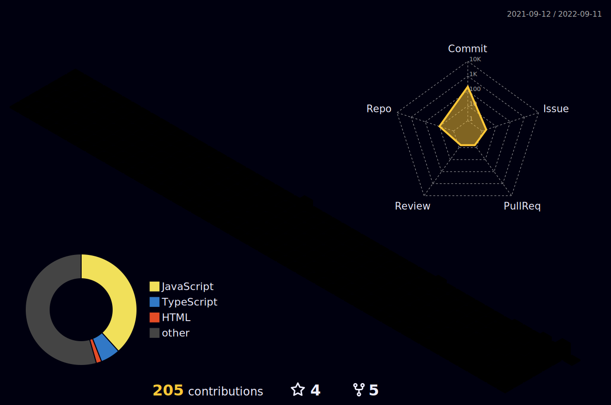

### 🔥 Hey! This is frontendBoy-Wang

- 🔭 I’m currently working on WuHan and is a full stack programmer engineer
- 🌱 I’m currently learning JS,Golang,Python,Linux,Mysql,Docker
- 🤔 I’m looking for help with a job
- 💬 Ask me about javascript/typescript
- 📫 email: `1537957527@qq.com`
- 🆅 WeChat:`frontend_wang`
## 👨‍🚒 About me

Hello ,我是前端少年汪,是一位生活在武汉的全栈开发工程师,目前主要从事 PC端,小程序,移动端和golang，python等前后端相关的工作,目前在小厂担任全栈开发工程师

- github: [frontendBoy-Wang](https://github.com/frontendBoy-Wang)

- gitee:  [frontendBoy-Wang ](https://github.com/frontendBoy-Wang)

- 自我介绍：[MyBlog](https://frontendboy-wang.github.io/)

- 微信公众号:前端少年汪

- 微信号:frontBoy_wang  (备注:语雀),欢迎一起交流前端技术

- CSDN:[前端少年汪](https://blog.csdn.net/qq_44647871?spm=1000.2115.3001.5343)

- 掘金:[前端少年汪](https://juejin.cn/user/3570847174897447)

- B站:[前端少年汪](https://space.bilibili.com/392982262)

- 抖音:前端少年汪

## ⚡ My status

  

> 
从明天起，做一个新思维的人  
> 继承，多态，层层封装  
> 从明天起,不再关心内存管理 让每一条数据，自动放到合适的位子上  
> 从明天起，我将为每一个对象 取一个温暖的名字  
> 它们用驼峰命名，优雅，大方 
> 陌生人，我也祝福你哈 愿你不再为系统级bug烦恼  
> 愿你在平台之间肆意游荡 愿你不再关心溢出与异常 

### 🧰 Tech Stacks

### 💻 Stats

